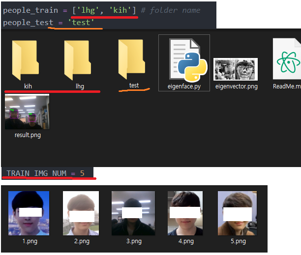
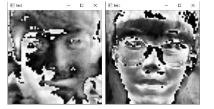
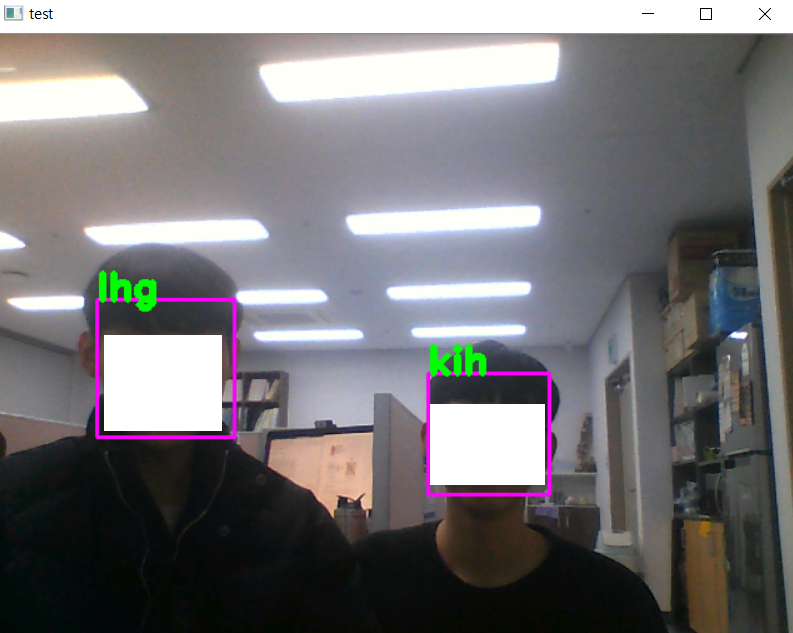

## PCA와 Eigenvector를 이용한 얼굴 식별기

### 1. 데이터셋 로드

 - 소스코드의 people_train 리스트에 학습할 사람 폴더 생성
 - 학습데이터를 1~N에 대해 k.png 형태로 저장
 - 5장 이상 학습하고 싶다면 TRAIN_IMG_NUM을 수정
 - test 디렉토리에도 비슷하게 세팅

### 2. Image Crop

 - haarcascade_frontalface_default (OpenCV)
  - 자동적으로 얼굴을 인식하고 crop하여 사용함

### 3. PCA Training & EigenVector

 - 학습데이터(D\*H\*W)를 (D*V)로 flatten
 - PCA를 이용하여 V size의 EigenVector 추출
 - EigenVector에 mean값을 차감

### 4. Classification

 - 테스트 이미지의 EigenVector와 mean을 구함
 - 단순히 유클리디안 오류를 이용하여 식별

### 5. 결과

 - 어느 정도 정확함
 - <b> 고유 벡터가 얼굴 인식에서 적절한 특징으로 사용 가능한 것으로 보임 </b>
